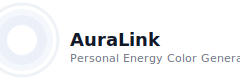

🌈 AuraLink – Personal Energy Color Generator
✨ Discover Your Inner Energy Through Colors

  

AuraLink is a mood-based interactive web app that generates a personalized aura color palette based on your emotions, personality, and energy.
Users answer a few quick questions, and the app visualizes their aura with smooth animations + gradients + glowing effects, giving a visually rich and calming experience.

🚀 Live Demo

🔗 Live Website: Add your hosted link here — GitHub Pages / Netlify / Vercel
Example format:
https://your-username.github.io/AuraLink/

🎨 Features

🌟 Mood & personality quiz for aura generation

🎨 Dynamic color palette creation

✨ Smooth glowing animations (CSS + JS)

🌀 Animated aura ring & gradient background

📱 Completely responsive UI

⚡ Fast, lightweight, and built with vanilla JS

🛠️ Tech Stack
Technology	Purpose
HTML5	Structure & content
CSS3 (Gradients, Glow, Animations)	Stylish UI & aura effects
JavaScript (Vanilla)	Aura logic, dynamic rendering
Hosting	GitHub Pages / Netlify / Vercel
📁 Project Structure
AuraLink/
│── index.html
│── style.css
│── script.js
└── assets/
      └── icons, images, animations

⚙️ How It Works

User answers mood/personality questions

Each answer is mapped to an energy category (Calm, Creative, Fiery, Balanced, etc.)

JS generates:

A unique color palette

A glowing aura ring

An animated gradient background

User sees a personalized aura with descriptions

📸 Preview

🧠 Aura Logic Example (JavaScript)

function generateAura(mood) {
    const auraColors = {
        calm: ["#6ECEDD", "#A8E6CF"],
        energetic: ["#FF6F61", "#FFB88C"],
        creative: ["#6A5ACD", "#C084FC"],
        balanced: ["#7ED957", "#B2F7EF"]
    };

    return auraColors[mood] || auraColors.balanced;
}

🚀 Run Locally
git clone https://github.com/Harini78-Tech/-Frontend-Innovation-Lab/edit/main/AuraLink.git
cd AuraLink
open index.html

🌍 Deployment (Hosting Guide)
✔️ GitHub Pages

Push project to GitHub

Go to Settings → Pages

Select main branch → /root

Your site goes live in seconds

✔️ Netlify

Drag & drop your folder to Netlify Deploy

Done — instant hosting

✔️ Vercel

Import GitHub repo → Deploy

Auto-optimized and super fast

💡 Future Enhancements

🔮 AI-based aura prediction

💜 Optional user accounts

🎧 Add sound-based aura visualization

🎁 Download aura as an image

🤝 Contributing

Pull requests are welcome! Feel free to improve animations, logic, UI, or accessibility.

🧚 Author

Harini Neha Kumar
🌟 Frontend Developer | Creative UI Builder
